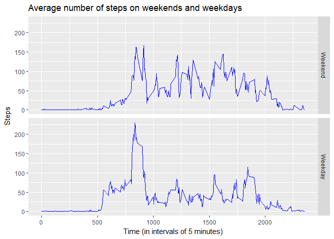

#Coursera 

This document illustrates data analysis from a personal activity monitoring device.

## Loading and preprocessing the data

Firstly, the data is unzipped, and loaded into a data frame. This assumes the the working directory contains the file "*activity.zip*". 
Secondly, the column containing the date is converted into the R date format. 


```r
unzip("activity.zip", overwrite = TRUE)

data_frame <- read.csv("activity.csv")

data_frame$date <- as.Date(data_frame$date, format = "%Y-%m-%d")
```

## What is the mean total number of steps taken per day?

After aggregating the data, a histogram can be plotted to illustrate the total number of steps taken per day. 

```r
aggdata <- aggregate(steps~date, data = data_frame, FUN=sum)
```

<!-- -->


The average of the total steps is 10766.19 and the median is 10765. 

## What is the average daily activity pattern?

After aggregating, a time series plot of  5-minute interval and the average number of steps taken can be shown.

```r
aggdata2 <- aggregate(steps~interval, data = data_frame, FUN=mean)
```

<!-- -->


Of the 5-minute intervals, the interval number 104 contains the maximum number of steps with 206.1698113 steps. 


## Imputing missing values


The total number of missing values is 2304.  
  
The following code replaces the missing  values with the average of that interval through the recording history.


```r
new_dataframe <- data_frame

new_dataframe$steps[is.na(new_dataframe$steps)] <- aggdata2$steps[match(new_dataframe$interval[is.na(new_dataframe$steps)], aggdata2$interval)]
```
After aggregating the data, we can plot a new histogram with the missing values extrapolated. 

```r
aggdata3 <- aggregate(steps~date, data = data_frame, FUN=sum)
```
<!-- -->

Naturally, neither the chart nor the mean (10766.19 ) and median (10765) have changed when using this method.  
  
It is not possible to use a daily average because the missing values occur only for days where the complete data is missing. The following code can be used to show the dates with missing data:

```r
missing_values <- unique(data_frame$date[is.na(data_frame$steps)])
```
The days with missing values are 2012-10-01, 2012-10-08, 2012-11-01, 2012-11-04, 2012-11-09, 2012-11-10, 2012-11-14, 2012-11-30.


## Are there differences in activity patterns between weekdays and weekends?

For this analysis, it is best to use the *dplyr* and *ggplot* libraries. 

The following code introduces a factor variable based on **weekday** or **weekend**:

```r
new_dataframe$weekday <- factor((weekdays(new_dataframe$date) %in% c("Monday", "Tuesday", "Wednesday", "Thursday", "Friday")), levels=c(FALSE, TRUE), labels=c('Weekend', 'Weekday'))

chart_data <- new_dataframe %>%
	group_by(interval, weekday) %>%
	summarise(steps = mean(steps))
```

This can then be plotted using *ggplot*:

```r
ggplot(chart_data, aes(interval, steps)) + geom_line(colour = "blue") + facet_grid(weekday ~ .) + labs(x = "Time (in intervals of 5 minutes)", y = "Steps", title = "Average number of steps on weekends and weekdays")
```

<!-- -->
